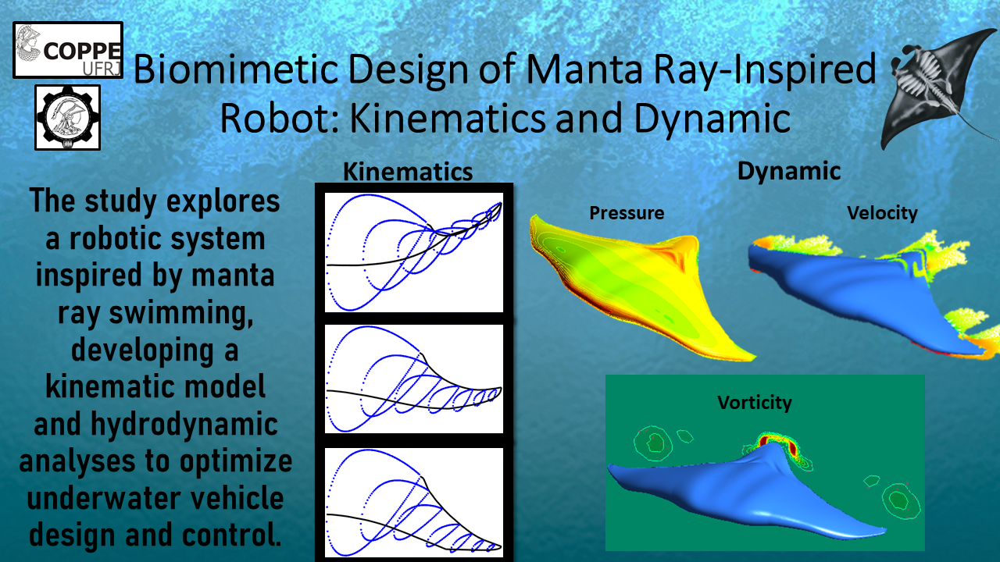

# Code for Kinematic and Hydrodynamic Analysis of a Manta Ray-Inspired Robot

Resources and extra documentation for the manuscript "Kinematic and Hydrodynamic Analysis of a Manta Ray-Inspired Robot". The project hierarchy and folders description is as follows:
1. Code
2. Images
3. Model
4. Video
5. Abstract

## Requirements

* Matlab 2021b or later. All additional packages (only needed codes) were uploaded in this repository.

## Detailed Overview of MATLAB Code Files for Manta Ray-Inspired Fin Simulation and Analysis

In the code section, the following files are presented, with their functionality and use explained in detail below:

Perfil_ala.m: This MATLAB code is designed to model and visualize the structure of a fin inspired by manta rays. It employs a geometric approach to define the radial segments and aerodynamic profile based on the NACA airfoil. The code begins by establishing several key parameters, such as the number of radial elements (R), the number of fin segments (S), the number of oscillatory waves along the fin, and parameters for oscillation, including frequency and amplitude. It calculates the length of each radial segment and constructs a matrix that captures the fin's shape and size. The linspace function is used to generate a range of values for the three-dimensional coordinates (x, y, z). The construction of the fin occurs within a nested loop that iterates through each segment and radial element, employing trigonometric functions to calculate the positions of the points that form the fin's geometry. These connections are visualized in a 3D plot, which provides an intuitive representation of the fin's structure. Additionally, the code includes an analysis of the NACA profile, represented graphically based on the calculated coordinates. This modeling is crucial for observing the fin's design and understanding its fluid dynamics.

ray_model.m: This MATLAB code simulates and tracks the positions of the segments of an oscillating fin inspired by manta rays over time. Initially, it defines several parameters that govern the fin's movement, such as the number of waves along the fin's chord (Nc), the number of waves across the span (Ns), the asymmetrical displacement (d), the maximum oscillation amplitude (tmax), and the oscillation frequency (w). It also calculates the number of radial elements (R) and the segments per radial element (S), along with their corresponding angular phases. The code establishes the length of each radial segment based on its position, creating a matrix that defines the fin's shape. The core of the simulation occurs in a temporal loop that iterates from 0 to 20 seconds in increments of 0.01 seconds. Within this loop, it calculates the positions of each segment at each time step using trigonometric functions to simulate the fin's oscillating motion, represented by the variable q. The computed positions are stored in auxiliary matrices (xaux, yaux, zaux) for each time instance. Ultimately, the code saves the segment position data along with simulation time and the numbers of radial elements and segments, facilitating subsequent analyses and visualizations of the fin's dynamic behavior.

ray_graph.m: This MATLAB code is responsible for loading the positions of a three-dimensional model simulating the oscillation of a robot’s fins inspired by the manta ray. At the beginning of execution, it loads previously saved data containing the positions along the x, y, and z axes, as well as the counts of radial elements and segments. The code defines rotation matrices to manipulate the model's orientation in three-dimensional space. Within a time loop, it updates the positions of each fin segment, drawing lines that connect points along the structure in a 3D graph. The code employs aerodynamic theory to calculate coordinates that represent the fin's shape during oscillation, thereby visualizing how the fins deform in response to movement. To enhance the dynamic presentation of the simulation, the view of the graph is adjusted periodically, and a brief delay is introduced, allowing viewers to appreciate the oscillation effects clearly.

ray_full.m: This MATLAB code focuses on visualizing and manipulating three-dimensional data of positions over time, which may be utilized for trajectory analysis of an object in three-dimensional space. It begins by clearing the workspace and loading position data (posx, posy, posz) and time from files, as well as variables related to the object's dimensions (nr and ns). The code defines rotation matrices (rx and ry) using symbolic variables (al, be, ga) representing rotation angles around the X and Y axes. These matrices are combined to form a total rotation matrix (rot). The graphical setup involves configuring the axes (X, Y, Z) and defining various views of the plot (top, front, side, and isometric). In a loop, the code plots lines in 3D to represent the trajectory of the object at each time step using the loaded data. This involves two nested loops to traverse different indices and draw connections between positions. Additionally, the code calculates the lengths of the chords between specific points and generates new points using parametric equations, which may describe the shape of a fin or another structure. The generated points are stored in matrices (xpi, ypi, zpi) and saved in text files for further analysis. The code also repeats a similar process for the right side of the visualization, applying transformations to reflect or alter the perspective. In summary, this code combines 3D visualization, trajectory calculations, and data saving, enabling the simulation of movement in structures inspired by nature, such as the wings of a manta ray, within a three-dimensional environment.
